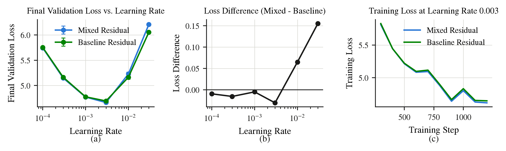

# Mixed residual ablation

Does replacing the residual connection

```
x = x + block.update(x)
```

with a half-and-half blend of the previous layer and the one before it

```
x = 0.5 * x_prev + 0.5 * x_two_back + block.update(x)   # first layer exempt
```

change the loss, when each variant is given its best learning rate out of six?

**Answer: `L_mixed - L_default = -0.0307`.** The mixed residual is slightly
*better*, and the gap is about 2.6x the seed-to-seed noise.

| | best validation loss | at learning rate |
|---|---|---|
| default residual | 4.6951 | 3e-3 |
| mixed residual | 4.6644 | 3e-3 |

## Result



**Figure 1 | Performance of mixed residual connections across learning rates.**
We compare a mixed residual, which combines the hidden states of layers $L-1$ and
$L-2$ in equal proportion, against the baseline residual connection from layer
$L-1$ alone. (a) Final validation loss as a function of learning rate; error bars
span two seeds. (b) Loss difference between the two variants, where negative
values indicate the mixed architecture attains lower loss. (c) Training loss at
learning rate $3\times10^{-3}$, the setting that minimises both variants. The
mixed residual attains consistent improvements at lower learning rates but
degrades as the learning rate increases. All models are 8-layer Transformers
trained for 78.6M tokens.

## Runs

All 24 runs are browsable on Weights & Biases: <https://wandb.ai/sglang-university-of-waterloo/mixed-residual-ablation>

Grouped by `residual` (`default` / `mixed`), with `lr` and `seed` in the config, so
the arms can be overlaid directly. `train/loss` and `train/grad_norm` carry the full
history; `final_val_loss` is the summary metric the comparison is scored on.

## Numbers

| learning rate | default | mixed | mixed - default |
|---|---|---|---|
| 1e-4 | 5.7526 | 5.7430 | -0.0095 |
| 3e-4 | 5.1639 | 5.1482 | -0.0156 |
| 1e-3 | 4.7768 | 4.7719 | -0.0049 |
| 3e-3 | 4.6951 | 4.6644 | -0.0307 |
| 1e-2 | 5.1639 | 5.2288 | +0.0649 |
| 3e-2 | 6.0516 | 6.2068 | +0.1552 |

Mean of 2 seeds. Seed noise `|s0 - s1|`: median 0.0116, max 0.0813 (n=12).

## Setup

Every number comes from `logs/`; nothing is staged.

- **Model** -- CS336 assignment-1 default shape with depth raised to 8: d_model 512,
  d_ff 1344 (= 8/3 * d_model rounded to a multiple of 64), 16 heads, pre-norm RMSNorm,
  SwiGLU, RoPE, no biases, untied head. 76.4M parameters, 24.9M non-embedding.
- **Data** -- C4 (`allenai/c4`, en), GPT-2 BPE, context 256.
- **Budget** -- 1200 steps x 65536 tokens = 78.6M tokens per run, AdamW, cosine to
  zero, 100 warmup steps, gradient clip 1.0.
- **Sweep** -- 6 learning rates x 2 arms x 2 seeds = 24 runs, one B300 each.
- **Framework** -- torchtitan, as an entry in `torchtitan/experiments/`.

Both arms run the same code path; `mixed_residual` is the only switch, so nothing
else can differ between them. The block returns its *update* rather than
`x + update`, which leaves the module signature identical to the stock
TransformerBlock -- torch.compile, activation checkpointing and the sharding
declarations all still wrap it unchanged. The residual *inside* the block is
untouched: the FFN still reads `x + attn(...)`. Only the connection between
blocks changes.

```python
x_two_back = None
for i, layer in enumerate(self.layers.values()):
    update = layer(x, attention_masks, positions)
    if self.mixed_residual and i > 0:
        residual = 0.5 * x + 0.5 * x_two_back
    else:
        residual = x
    x_two_back, x = x, residual + update
```

## Why the sign is what it is

The homogeneous recurrence `x_{i+1} = 0.5*x_i + 0.5*x_{i-1}` has characteristic
roots **1** and **-0.5**. The unit root is why this trains at all: the residual
stream neither decays nor explodes. Solving the impulse response
(`A + B = 1`, `A - 0.5B = 0.5`) gives **A = 2/3**, so each block's contribution
reaches the output attenuated to two thirds, plus a `(-1/2)^n` ripple that is dead
within about four layers.

Reading that as a *cost* -- a diluted identity path -- predicts mixed should lose.
That prediction was wrong. A uniform 2/3 down-weighting of every block's
contribution is close to the `1/sqrt(L)` residual scaling that is known to help,
and the extra path to two layers back is a second route for gradient, which is the
thing learned versions of this idea (hyper-connections in DeepSeek-V4.1, Qwen4-exp)
actually monetize. The high-learning-rate blow-up is the honest cost.

## Caveats

- The learning-rate grid is 3x spaced. Both arms peak at 3e-3 and mixed degrades
  faster above it, so a finer grid between 3e-3 and 1e-2 could shrink or flip this.
- n = 2 seeds, one depth, one token budget. A 0.03 effect on this evidence is
  suggestive, not settled.

## Files

- `scripts/extract.py` -- logs to `results.json`
- `scripts/make_neurips_figure.py` -- `results.json` to `figures/mixed_residual.{png,pdf}`
- `scripts/thread_visuals.py` -- vega-lite chart helpers
- `model.py`, `experiment___init__.py`, `config_registry.py` -- the torchtitan experiment
- `sweep.sh` -- the 24-run sweep
- `logs/` -- raw training logs for all 24 runs

